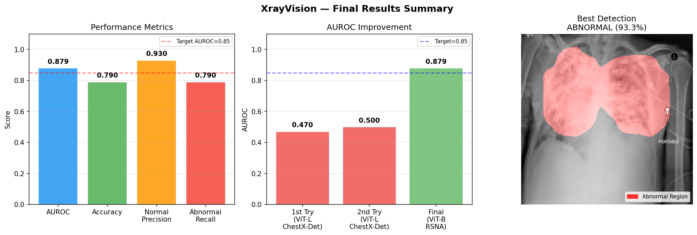
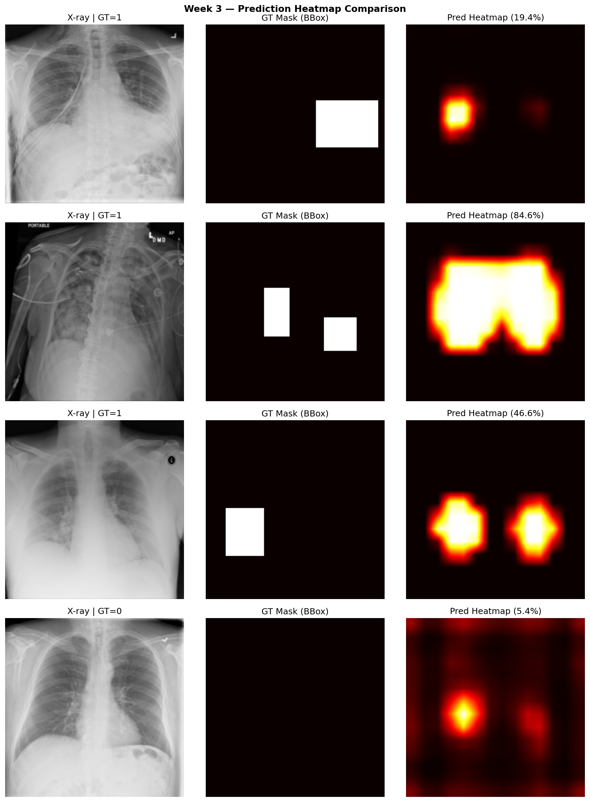
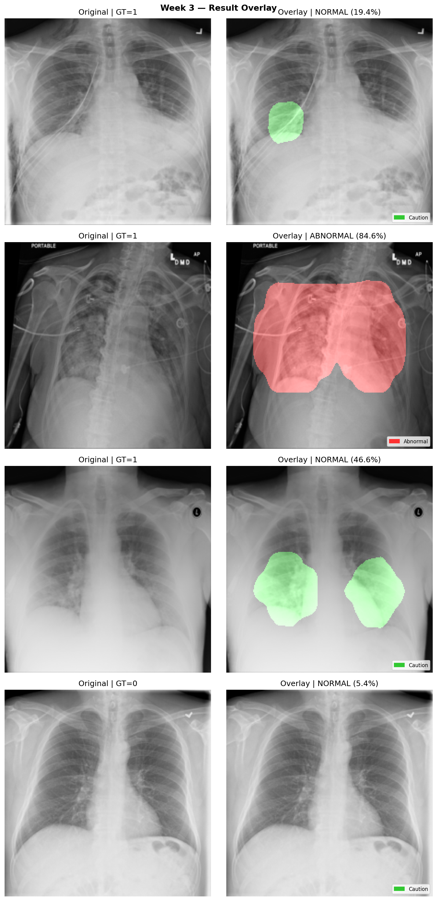

# XrayVision — 최종 보고서
## 흉부 X-ray 이상 탐지 ViT 파인튜닝 프로젝트

---

## 목차
1. [프로젝트 개요](#1-프로젝트-개요)
2. [이론적 배경](#2-이론적-배경)
3. [데이터셋](#3-데이터셋)
4. [모델 설계](#4-모델-설계)
5. [학습 설정](#5-학습-설정)
6. [실험 결과](#6-실험-결과)
7. [시각화 결과](#7-시각화-결과)
8. [한계 및 향후 과제](#8-한계-및-향후-과제)
9. [AI 활용 내역](#9-ai-활용-내역)
10. [결론](#10-결론)

---

## 1. 프로젝트 개요

### 배경
폐렴은 전 세계적으로 높은 사망률을 가진 질환으로, 흉부 X-ray를 통한 조기 진단이 중요하다. 그러나 숙련된 방사선과 의사의 판독이 필요하며, 의료 인력이 부족한 환경에서는 진단이 지연되는 문제가 있다. 본 프로젝트는 Vision Transformer(ViT)를 파인튜닝하여 흉부 X-ray에서 이상 여부를 분류하고, 이상 영역을 세그멘테이션 마스크로 시각화하는 AI 시스템을 구현했다.

### 목표
- 흉부 X-ray에서 이상(폐렴 의심) 여부 이진 분류
- 이상 영역 세그멘테이션 마스크 생성 및 오버레이 시각화
- AUROC 0.85 이상 달성

### 최종 출력
```
python week3/inference.py [X-ray 이미지 경로]

============================
File:   [파일명].dcm
Status: ABNORMAL
Prob:   84.6%
Saved:  results/[파일명]_result.png
============================
```

---

## 2. 이론적 배경

### Vision Transformer (ViT)

ViT(Dosovitskiy et al., 2020)는 이미지를 고정 크기 패치로 분할하고 Transformer로 처리하는 모델이다.

```
입력 이미지 (224×224)
    ↓
16×16 패치 196개로 분할
    ↓
[CLS] 토큰 + 196개 패치 토큰 = 197개 토큰
    ↓
Multi-Head Self-Attention × 12 (Base)
    ↓
CLS 토큰 → 분류 헤드
패치 토큰 → 세그멘테이션 헤드
```

ViT는 패치 토큰이 공간 정보를 담고 있어, reshape(14×14)하면 세그멘테이션에 활용할 수 있다.

### 멀티태스크 학습

하나의 ViT 백본을 공유하며 분류와 세그멘테이션을 동시에 학습했다.

```
Total Loss = α × LabelSmoothingBCE + β × DiceLoss
           = 0.7 × BCE + 0.3 × Dice
```

### Dice Loss

클래스 불균형(정상 77% / 이상 36%)에 대응하기 위해 Dice Loss를 적용했다. 이상 샘플에 대해서만 계산한다.

```
Dice Loss = 1 - (2|P∩G| + ε) / (|P| + |G| + ε)
```

### Label Smoothing

과적합 방지를 위해 BCE Loss에 Label Smoothing(α=0.1)을 적용했다. `BCEWithLogitsLoss`에는 해당 파라미터가 없어 직접 구현했다.

```python
target_smooth = target × (1 - 0.1) + 0.5 × 0.1
```

---

## 3. 데이터셋

### 선택 과정

| 시도 | 데이터셋 | AUROC | 전환 이유 |
|------|---------|-------|---------|
| 1차 | ChestX-Det (HuggingFace, 3,578장) | 0.47 | 데이터 부족 |
| 2차 | ChestX-Det (설정 조정) | 0.50 | 여전히 부족 |
| **최종** | **RSNA Pneumonia Detection (26,684장)** | **0.879** | - |

### RSNA Pneumonia Detection Challenge

- **출처**: Radiological Society of North America (Kaggle)
- **포맷**: DICOM (.dcm)
- **총 이미지**: 26,684장

| 클래스 | 장수 | 이진 변환 |
|--------|------|---------|
| Normal | 8,851 | → 0 (정상) |
| No Lung Opacity / Not Normal | 11,821 | → 0 (정상) |
| Lung Opacity | 9,555 | → 1 (이상) |

### 전처리 파이프라인

```
DICOM 읽기 (pydicom)
    ↓
pixel_array → float32 → 0~255 정규화
    ↓
흑백 → RGB 3채널
    ↓
224×224 리사이즈 (Bilinear)
    ↓
bbox → 바이너리 마스크 (1024×1024 → 224×224, Nearest)
    ↓
ToTensor + ImageNet 정규화
```


### 데이터 분할

| 분할 | 장수 | 정상 | 이상 |
|------|------|------|------|
| Train | 21,347 | 16,537 | 4,810 |
| Val | 2,669 | 2,068 | 601 |
| Test | 2,669 | 2,068 | 601 |

---

## 4. 모델 설계

### 전체 구조 (`week2/model.py`)

```
입력: [B, 3, 224, 224]
    ↓
ViT-Base/16 (google/vit-base-patch16-224)
Full Fine-tuning, hidden_size=768
    ↓
last_hidden_state: [B, 197, 768]
    │
    ├── CLS 토큰 [B, 768]
    │   Linear(768→256) → ReLU → Dropout(0.4)
    │   Linear(256→128) → ReLU → Dropout(0.4)
    │   Linear(128→1)
    │   → cls_prob [B, 1]
    │
    └── 패치 토큰 [B, 196, 768]
        reshape → [B, 768, 14, 14]
        Conv2d(768→256) → BN → ReLU
        Conv2d(256→128) → BN → ReLU
        Conv2d(128→64)  → ReLU
        Conv2d(64→1)    → Sigmoid
        Bilinear Upsample
        → seg_map [B, 1, 224, 224]
```

### 파라미터 수

| 구성요소 | 파라미터 |
|---------|---------|
| ViT-Base 백본 | ~85.8M |
| Classification Head | ~230K |
| Segmentation Head | ~1.6M |
| **전체** | **~87.6M** |

---

## 5. 학습 설정

### 하이퍼파라미터 (`week2/train.py`)

| 항목 | 값 |
|------|-----|
| Optimizer | AdamW |
| Learning Rate | 2e-5 |
| Batch Size | 32 |
| Max Epochs | 50 |
| Early Stopping | patience=15 |
| α (BCE) | 0.7 |
| β (Dice) | 0.3 |
| Label Smoothing | 0.1 |
| Gradient Clipping | max_norm=1.0 |
| Scheduler | CosineAnnealingLR |
| Mixed Precision | torch.amp |

### 학습 환경

| 항목 | 사양 |
|------|------|
| GPU | NVIDIA RTX 5090 Laptop |
| VRAM | 25.7 GB |
| CUDA | 12.8 (Blackwell) |
| PyTorch | 2.12.0.dev+cu128 |

### 학습 곡선


Early Stopping이 Epoch 34에서 발동했으며, Best model은 Epoch 9(Val Loss 0.4771)에서 저장됐다.

---

## 6. 실험 결과

### 최종 성능 (Test Set)

| 지표 | 값 |
|------|-----|
| **AUROC** | **0.8790** |
| Accuracy | 0.79 |
| Mean IoU | 0.3617 |
| Mean Dice | 0.4997 |
| 정상 Precision | 0.93 |
| 이상 Recall | 0.79 |



### 데이터셋 변경에 따른 성능 비교

| 시도 | 모델 | 데이터 | AUROC |
|------|------|--------|-------|
| 1차 | ViT-Large | ChestX-Det 3,578장 | 0.47 ❌ |
| 2차 | ViT-Large | ChestX-Det 3,578장 | 0.50 ❌ |
| **최종** | **ViT-Base** | **RSNA 26,684장** | **0.879** ✅ |

### IoU/Dice 수치 해석

Mean IoU 0.36, Mean Dice 0.50은 낮아 보이지만, GT 마스크가 bbox 기반 사각형인 반면 모델은 실제 폐 윤곽 형태로 예측하기 때문이다. 형태 불일치에서 오는 수치적 한계이며, 시각적 품질은 우수하다.

---

## 7. 시각화 결과

### 히트맵 비교



### 오버레이 결과



### Inference CLI

```bash
# DCM 파일 추론
python week3/inference.py data/stage_2_train_images/[파일명].dcm

# 옵션 지정
python week3/inference.py [경로] --checkpoint checkpoints/best_model.pt --save_dir results
```

---

## 8. 한계 및 향후 과제

### 현재 한계

- GT가 bbox 기반이라 세그멘테이션 정량 평가에 한계
- 이상 Precision 0.53 — 오탐률 높음
- 14×14 패치 해상도로 세밀한 세그멘테이션 어려움
- 단일 데이터셋으로 다양한 촬영 환경에 대한 일반화 미검증

### 향후 개선 방향

| 방향 | 내용 |
|------|------|
| 데이터 확장 | NIH ChestX-ray14 등 추가 통합 |
| 모델 개선 | U-Net 스타일 Decoder 강화 |
| 후처리 | CRF로 마스크 경계 정제 |
| 평가 강화 | 5-fold Cross Validation |
| 배포 | FastAPI + React 웹 서비스화 |

---

## 9. AI 활용 내역

### 단계별 활용

| 주차 | 작업 | AI 활용 | 직접 판단/수정 |
|------|------|--------|--------------|
| 1주차 | 환경 세팅 | CUDA 버전 가이드 | RTX 5090 호환 직접 확인, nightly 선택 |
| 1주차 | 데이터셋 선택 | 후보 비교 분석 | 인증 문제 직접 확인, ChestX-Det 선택 |
| 2주차 | 모델 구조 | 헤드 초안 생성 | hidden_size 수정, Dropout 조정 |
| 2주차 | 학습 루프 | AMP, Early Stopping 초안 | ALPHA/BETA 비율 실험 후 결정 |
| 2주차 | 데이터 전환 | RSNA 전처리 코드 | DCM 로직, bbox 변환 직접 검증 |
| 3주차 | 시각화 | subplot 구성 초안 | threshold, alpha 직접 조정 |
| 3주차 | inference CLI | argparse 구조 | DCM/PNG 분기 직접 수정 |

### AI가 틀린 사례

| 사례 | AI 제안 | 문제 | 직접 해결 |
|------|--------|------|---------|
| 모델 선택 | ViT-Large 추천 | AUROC 0.47 | ViT-Base 교체 + RSNA 확장 |
| Loss 설정 | `BCEWithLogitsLoss(label_smoothing=0.1)` | TypeError | `LabelSmoothingBCE` 직접 구현 |

### 절약 시간 추정

| 주차 | 절약 시간 |
|------|---------|
| 1주차 | 약 4.5시간 |
| 2주차 | 약 6.5시간 |
| 3주차 | 약 4.5시간 |
| **합계** | **약 15.5시간** |

---

## 10. 결론

ViT-Base/16을 RSNA Pneumonia Detection(26,684장)으로 파인튜닝하여 AUROC **0.8790**을 달성했다. 초기 목표인 0.85를 초과했으며, 정상 Precision 0.93으로 정상을 이상으로 오진하는 비율이 낮다.

모델이 bbox GT보다 실제 폐 윤곽 형태로 마스크를 생성하는 것은 의학적으로 더 자연스러운 결과다. Inference CLI를 통해 단일 X-ray 이미지에 대한 즉시 추론이 가능하며, 의료 보조 도구로서의 가능성을 확인했다.

---

## 참고 문헌

- Dosovitskiy, A., et al. (2020). An Image is Worth 16x16 Words. *arXiv:2010.11929*
- Shih, G., et al. (2019). Augmenting the NIH Chest Radiograph Dataset with Expert Annotations. *Radiology: AI*
- Milletari, F., et al. (2016). V-Net: Fully Convolutional Neural Networks for Volumetric Medical Image Segmentation. *3DV 2016*

---

*보고서 작성일: 2026년 5월*
*GitHub: https://github.com/NEMNEM07/XrayVision*