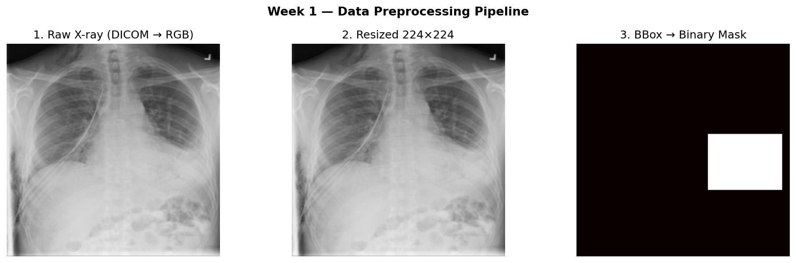

# 1주차 활동 보고서
## 프로젝트: XrayVision — 흉부 X-ray 이상 탐지

---

## 목표
개발 환경 구성, 데이터셋 탐색 및 전처리 파이프라인 설계, PyTorch Dataset/DataLoader 구현

---

## 환경 세팅

Python 3.11 기반 venv 가상환경을 구성하고, RTX 5090 Laptop GPU(Blackwell, sm_120)의 CUDA 호환성 문제를 해결하기 위해 PyTorch nightly(cu128) 버전으로 설치했다. 기존 PyTorch 2.5.1+cu121은 sm_120 아키텍처를 지원하지 않아 `UserWarning`이 발생했고, 2.12.0.dev+cu128로 교체하여 해결했다.

**최종 환경:**
```
PyTorch:      2.12.0.dev20260408+cu128
CUDA:         True (sm_120, Blackwell)
GPU:          NVIDIA GeForce RTX 5090 Laptop GPU
VRAM:         25.7 GB
Transformers: 5.8.0
OpenCV:       4.13.0
```

환경 확인 스크립트: `week1/config.py`

---

## 데이터셋 탐색 및 선택 과정

여러 흉부 X-ray 데이터셋을 검토하면서 다음 조건을 기준으로 선택했다:
- 세그멘테이션 마스크 또는 bbox 레이블 포함
- 충분한 데이터 규모

| 검토 데이터셋 | 장수 | 결과 |
|------------|------|------|
| ChestX-Det (HuggingFace) | 3,578장 | 마스크 있음, 인증 없음 → 1차 시도했으나 데이터 부족으로 탈락 |
| VinBigData Chest X-ray | 18,000장 | Kaggle 403 오류 → 탈락 |
| NIH ChestX-ray14 | 112,000장 | bbox 1,000장뿐 → 탈락 |
| **RSNA Pneumonia Detection** | **26,684장** | **bbox 전체 포함, Kaggle 인증 후 선택** |

**최종 선택: RSNA Pneumonia Detection Challenge**
- 26,684장 DICOM 포맷
- bbox 레이블 포함 (Lung Opacity 클래스)
- 3개 클래스 → 이진 분류 변환

> **데이터셋 선택 히스토리:** 처음엔 Kaggle 인증 문제로 ChestX-Det(3,578장)을 먼저 시도했으나 AUROC 0.47(랜덤 수준)이 나왔다. 데이터 부족이 원인으로 판단하여 Kaggle 인증 후 RSNA(26,684장)로 전환했다.

---

## 전처리 파이프라인 구현

RSNA DICOM 파일 기준으로 전처리 파이프라인을 구현했다.

```
DICOM 파일 읽기 (pydicom)
    ↓
pixel_array → float32 → 0~255 정규화
    ↓
흑백 → RGB 3채널 변환
    ↓
224×224 리사이즈 (Bilinear)
    ↓
bbox → 바이너리 마스크 변환 (1024×1024 → 224×224, Nearest)
    ↓
ToTensor + ImageNet 정규화
(mean=[0.485, 0.456, 0.406], std=[0.229, 0.224, 0.225])
```



**DICOM 이미지 로드:**
```python
def load_rsna_image(dcm_path):
    dcm = pydicom.dcmread(dcm_path)
    img = dcm.pixel_array.astype(np.float32)
    img = (img - img.min()) / (img.max() - img.min() + 1e-8) * 255
    img_pil = Image.fromarray(img.astype(np.uint8)).convert('RGB')
    return img_pil.resize((224, 224), Image.BILINEAR)
```

**bbox → 바이너리 마스크 변환:**
```python
def make_rsna_mask(bboxes, orig_size=1024):
    mask = np.zeros((orig_size, orig_size), dtype=np.float32)
    for x, y, w, h in bboxes:
        mask[int(y):int(y+h), int(x):int(x+w)] = 1.0
    mask_pil = Image.fromarray((mask * 255).astype(np.uint8))
    return np.array(mask_pil.resize((224, 224), Image.NEAREST)) / 255.0
```

---

## 데이터 분할

전체 26,684장을 stratify 옵션으로 클래스 비율을 유지하며 8:1:1 분할했다.

| 분할 | 장수 | 정상 | 이상 |
|------|------|------|------|
| Train | 21,347장 | 16,537 | 4,810 |
| Val | 2,669장 | 2,068 | 601 |
| Test | 2,669장 | 2,068 | 601 |

정상 77% / 이상 36%로 클래스 불균형이 있어 `WeightedRandomSampler` 도입을 결정했다.

---

## PyTorch Dataset / DataLoader 구현

`XrayDataset` 클래스를 구현하여 이미지, 마스크, 라벨을 반환하도록 했다.

**데이터 증강 (Train 전용):**
```python
T.RandomHorizontalFlip(p=0.5)
T.RandomVerticalFlip(p=0.2)
T.RandomRotation(degrees=15)
T.ColorJitter(brightness=0.3, contrast=0.3)
T.RandomAffine(degrees=0, translate=(0.1, 0.1))
T.GaussianBlur(kernel_size=3, sigma=(0.1, 2.0))
T.Normalize(mean=[0.485, 0.456, 0.406], std=[0.229, 0.224, 0.225])
```

**DataLoader 구성:**
- Train: `batch=32, WeightedRandomSampler, num_workers=4, pin_memory=True`
- Val/Test: `batch=32, shuffle=False`

최종 출력 형태:
```
이미지: torch.Size([3, 224, 224]), float32
마스크: torch.Size([1, 224, 224]), float32
라벨:   tensor(0. or 1.)
```

---

## 트러블슈팅

| 문제 | 원인 | 해결 |
|------|------|------|
| `conda` 명령어 인식 안 됨 | Anaconda 미설치 | venv로 전환 |
| RTX 5090 CUDA 경고 | PyTorch 2.5.1이 sm_120 미지원 | nightly cu128로 교체 |
| `datasets` 모듈 없음 | 시스템 Python에 설치됨 | pip 복구 후 venv에 재설치 |
| Kaggle 403 오류 | 전화번호 인증 필요 | 인증 후 RSNA 다운로드 |
| DICOM `stage_2_train_labels.csv` 폴더로 인식 | 압축 해제 시 폴더 구조 중첩 | 경로를 `data/stage_2_train_labels.csv/stage_2_train_labels.csv`로 수정 |

---

## AI 활용 내역

| 작업 | AI 활용 | 직접 판단/수정 |
|------|--------|--------------|
| CUDA 버전 선택 | 버전별 호환성 분석 | RTX 5090 sm_120 직접 확인 후 nightly 결정 |
| 데이터셋 비교 | 후보 데이터셋 분석 | 인증 문제, 데이터 크기 직접 확인 후 결정 |
| 전처리 코드 | DICOM 읽기, 마스크 변환 초안 | orig_size=1024 직접 확인, 변환 로직 검증 |
| DataLoader 설정 | WeightedRandomSampler 방법 제시 | num_workers, pin_memory 직접 실험 |

**AI가 틀린 사례:** AI가 처음에 인증 없는 ChestX-Det을 추천했으나 데이터 부족(3,578장)으로 AUROC 0.47이 나왔다. 직접 Kaggle 인증 후 RSNA로 재전환하여 문제를 해결했다.

---

## 생성 파일

```
week1/
├── config.py        # 환경 확인 스크립트
└── data_split.py    # Train/Val/Test 분할 생성
week2/
└── dataset.py       # RSNA Dataset 클래스 (전처리 파이프라인 포함)
```