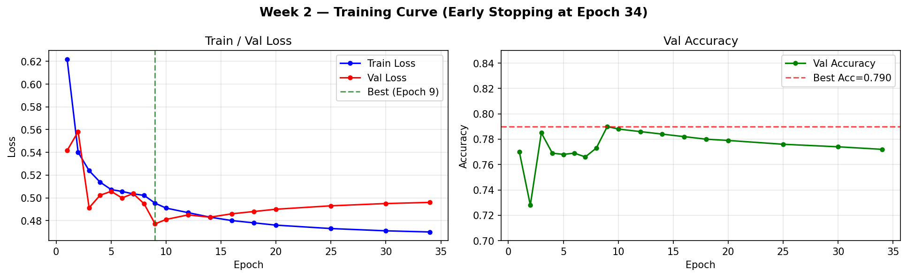

# 2주차 활동 보고서
## 프로젝트: XrayVision — 흉부 X-ray 이상 탐지

---

## 목표
ViT 모델 구현, 멀티태스크 학습 파이프라인 구축, RSNA 데이터셋 통합, 학습 실행 및 평가

---

## 모델 설계

### ViT-Base/16 선택 이유

초기에는 ViT-Large(307M 파라미터)를 시도했으나 데이터 3,578장 기준으로 AUROC 0.47(랜덤 수준)이 나왔다. 데이터 크기와 모델 복잡도의 불균형이 원인으로 판단하여 ViT-Base(86M)로 교체했다.

| 모델 | 파라미터 | 권장 데이터 | 실제 성능 |
|------|---------|-----------|---------|
| ViT-Large | 307M | 100,000장~ | AUROC 0.47 ❌ |
| **ViT-Base** | **86M** | **10,000장~** | **AUROC 0.879 ✅** |

### 전체 구조 (`week2/model.py`)

```
입력: [B, 3, 224, 224]
    ↓
ViT-Base/16 Backbone
(google/vit-base-patch16-224, Full Fine-tuning)
    ↓
last_hidden_state: [B, 197, 768]
    │
    ├── CLS 토큰 [B, 768]
    │       ↓
    │   Linear(768→256) → ReLU → Dropout(0.4)
    │   Linear(256→128) → ReLU → Dropout(0.4)
    │   Linear(128→1)
    │       ↓
    │   cls_prob [B, 1]
    │
    └── 패치 토큰 [B, 196, 768]
            ↓
        reshape → [B, 768, 14, 14]
            ↓
        Conv2d(768→256) → BN → ReLU
        Conv2d(256→128) → BN → ReLU
        Conv2d(128→64)  → ReLU
        Conv2d(64→1)    → Sigmoid
            ↓
        Bilinear Upsample → [B, 1, 224, 224]
```

**총 파라미터: ~87.6M**

### 손실 함수

멀티태스크 학습을 위해 분류와 세그멘테이션 loss를 결합했다.

```
Total Loss = 0.7 × LabelSmoothingBCE + 0.3 × DiceLoss
```

- **LabelSmoothingBCE (smoothing=0.1):** `BCEWithLogitsLoss`에 label smoothing이 없어 직접 구현. 과적합 방지.
- **DiceLoss:** 이상 샘플에 대해서만 계산. 정상 샘플(빈 마스크)은 스킵.

---

## 데이터셋 전환: ChestX-Det → RSNA

1주차에서 구축한 ChestX-Det 파이프라인으로 학습했으나 AUROC 0.47이 나와 데이터 부족으로 판단했다. Kaggle 인증 후 RSNA Pneumonia Detection으로 전환했다.

**RSNA 데이터셋 구성:**

| 클래스 | 장수 |
|--------|------|
| Normal | 8,851장 |
| No Lung Opacity / Not Normal | 11,821장 |
| Lung Opacity (이상) | 9,555장 |
| **합계** | **26,684장** |

3개 클래스를 이진 분류로 변환: Normal + No Lung Opacity → 0, Lung Opacity → 1

**DICOM 전처리 파이프라인 (`week2/dataset.py`):**
```python
dcm = pydicom.dcmread(dcm_path)
img = dcm.pixel_array.astype(np.float32)
img = (img - img.min()) / (img.max() - img.min() + 1e-8) * 255
img_pil = Image.fromarray(img.astype(np.uint8)).convert('RGB')
img_pil = img_pil.resize((224, 224), Image.BILINEAR)
```

**bbox → 바이너리 마스크 변환:**
```python
mask = np.zeros((1024, 1024), dtype=np.float32)
for x, y, w, h in bboxes:
    mask[y:y+h, x:x+w] = 1.0
mask = resize(mask, (224, 224), NEAREST)
```

**8:1:1 분할 결과:**

| 분할 | 장수 | 정상 | 이상 |
|------|------|------|------|
| Train | 21,347장 | 16,537 | 4,810 |
| Val | 2,669장 | 2,068 | 601 |
| Test | 2,669장 | 2,068 | 601 |

---

## 학습 설정 (`week2/train.py`)

| 항목 | 값 |
|------|-----|
| Optimizer | AdamW |
| Learning Rate | 2e-5 |
| Batch Size | 32 |
| Max Epochs | 50 |
| Early Stopping | patience=15 |
| α (BCE) | 0.7 |
| β (Dice) | 0.3 |
| Label Smoothing | 0.1 |
| Gradient Clipping | max_norm=1.0 |
| Scheduler | CosineAnnealingLR |
| Mixed Precision | torch.amp (AMP) |

**클래스 불균형 처리:**
```python
weights = [1.0 / (train_lbl.count(l) + 1e-8) for l in train_lbl]
sampler = WeightedRandomSampler(weights, num_samples=len(weights), replacement=True)
```

---

## 학습 결과

Early Stopping이 Epoch 34에서 발동했다.

| Epoch | Train Loss | Train Acc | Val Loss | Val Acc |
|-------|-----------|----------|---------|--------|
| 1 | 0.6220 | 0.720 | 0.5416 | 0.770 |
| 3 | 0.5239 | 0.783 | 0.4913 | 0.785 |
| 9 | 0.4953 | 0.799 | **0.4771** | **0.790** ← Best |
| 34 | - | - | Early Stop | - |



---

## 평가 결과 (`week2/metrics.py`)

```
AUROC:     0.8790
Mean IoU:  0.3617
Mean Dice: 0.4997

              precision    recall  f1-score   support
        정상       0.93      0.79      0.86      2068
        이상       0.53      0.79      0.63       601
    accuracy                           0.79      2669
```

---

## 트러블슈팅

| 문제 | 원인 | 해결 |
|------|------|------|
| AUROC 0.47 | ViT-Large + 데이터 3,578장 부족 | ViT-Base + RSNA 26,684장으로 교체 |
| `BCELoss` autocast 오류 | BCELoss는 autocast 미지원 | `BCEWithLogitsLoss`로 교체 |
| `label_smoothing` 파라미터 없음 | BCEWithLogitsLoss에 미구현 | `LabelSmoothingBCE` 직접 구현 |
| Windows multiprocessing 오류 | `num_workers>0` 시 main 보호 필요 | `if __name__ == '__main__'` + `main()` 함수 |
| `from week2.dataset import` 오류 | sys.path 미설정 | 각 파일 상단에 `sys.path.insert(0, root)` 추가 |

---

## AI 활용 내역

| 작업 | AI 활용 | 직접 판단/수정 |
|------|--------|--------------|
| 모델 구조 | 헤드 초안 생성 | hidden_size 1024→768 수정, Dropout 0.4 조정 |
| DiceLoss | 이상 샘플 필터링 로직 | smooth 파라미터 직접 조정 |
| 학습 루프 | AMP, Early Stopping 초안 | ALPHA/BETA 비율 실험 후 0.7/0.3 결정 |
| RSNA 전처리 | DCM 읽기, bbox→마스크 변환 | orig_size=1024 직접 확인 |

**AI가 틀린 사례:**
- ViT-Large 추천 → 데이터 부족으로 AUROC 0.47 → 직접 ViT-Base로 교체
- `BCEWithLogitsLoss(label_smoothing=0.1)` 제안 → TypeError → 커스텀 클래스 직접 구현

---

## 생성 파일

```
week2/
├── dataset.py    # RSNA DICOM 전처리 + PyTorch Dataset
├── model.py      # XrayViT (ViT-Base + Classification/Segmentation Head)
├── train.py      # 학습 루프 (AMP, Early Stopping, WeightedSampler)
└── metrics.py    # AUROC, IoU, Dice Score 평가
```